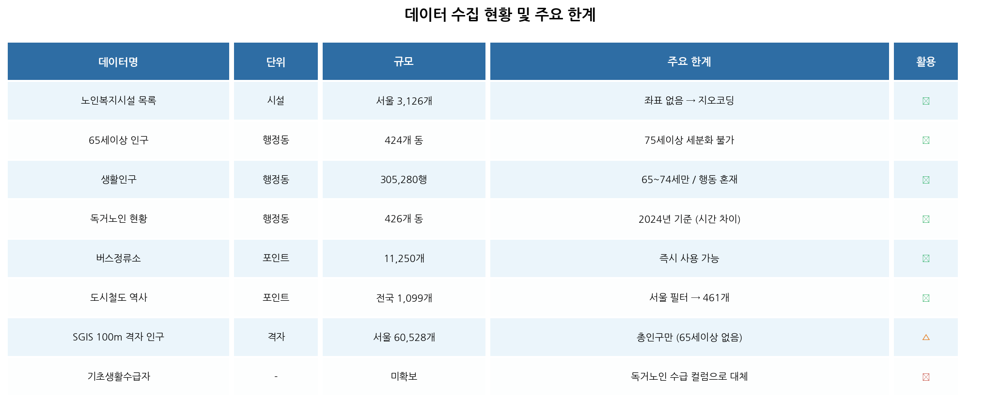
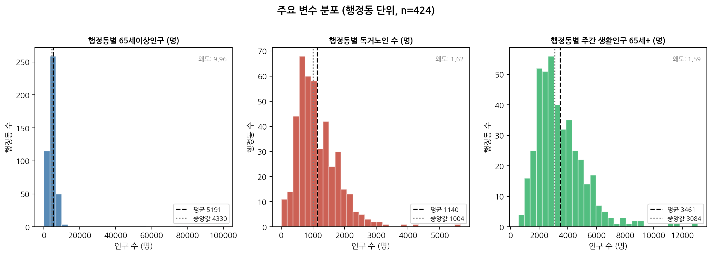
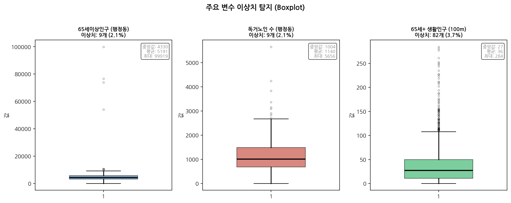
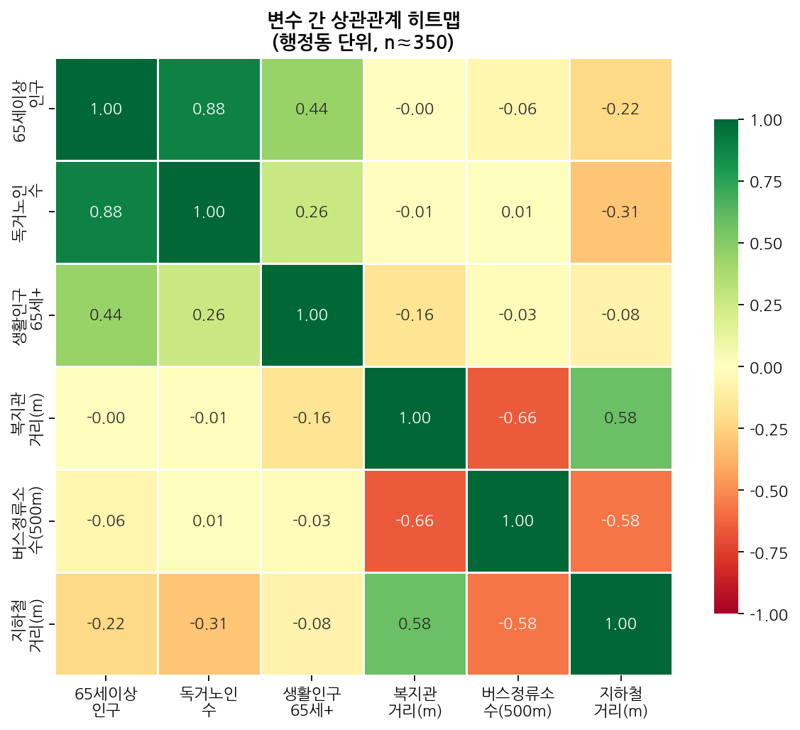
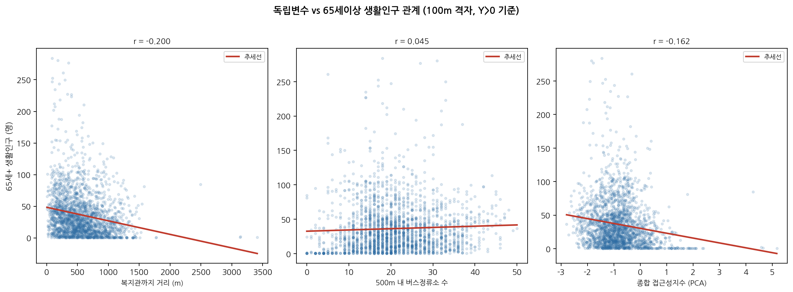
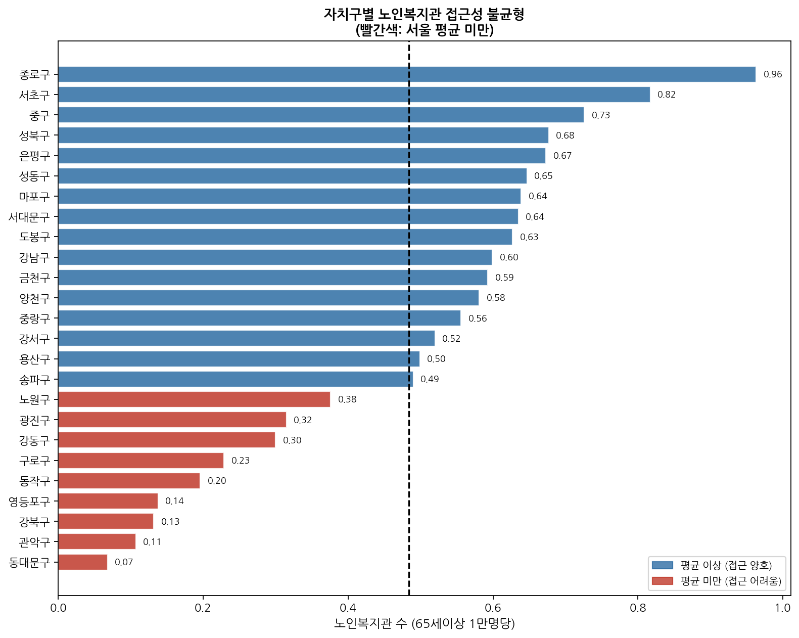
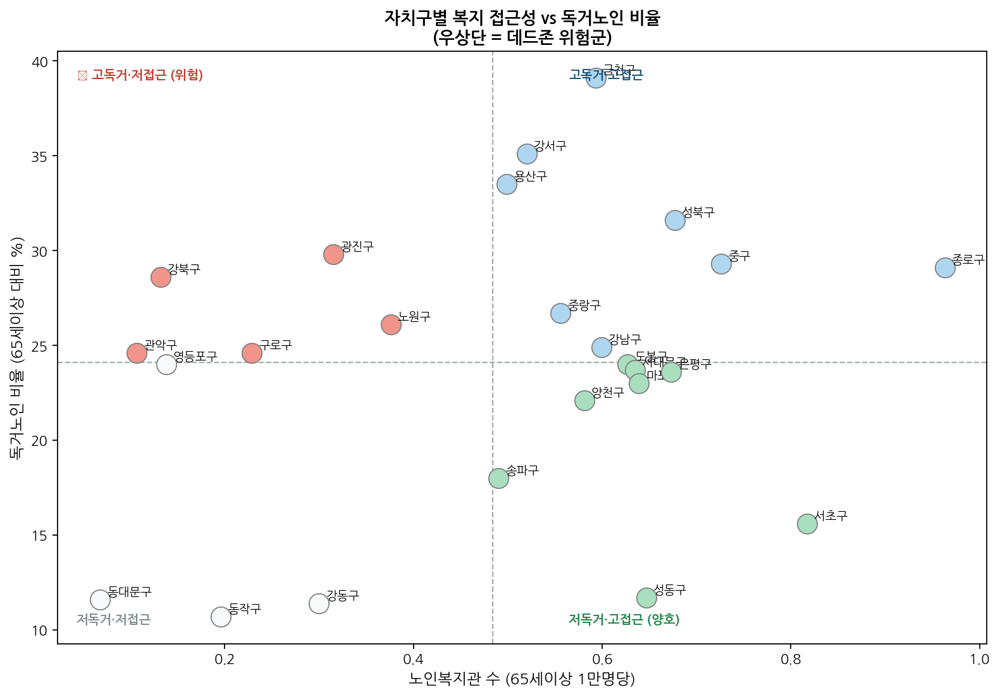
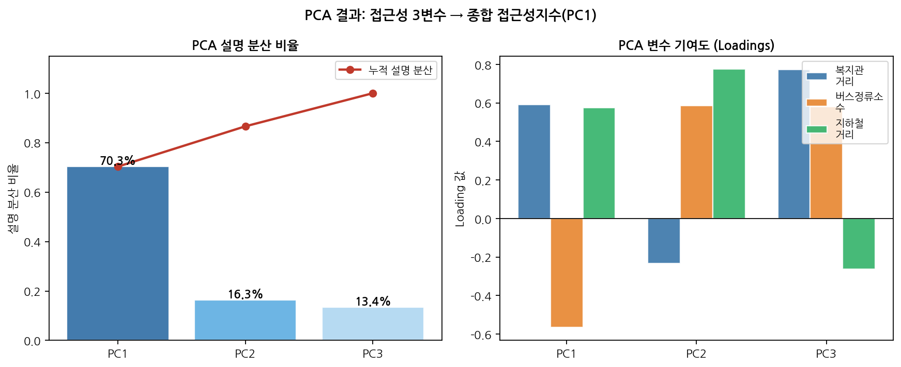
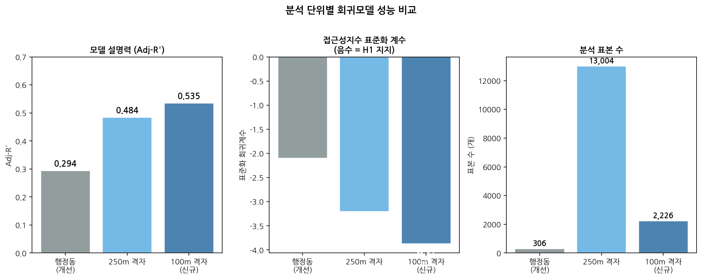

# Seoul Welfare Dead Zone Analysis — EDA Report

> Date: 2026-05-24
> Analysis Units: Administrative Neighborhoods (424) + 100m Grid Cells (60,528)
> Core Hypothesis (H1): Lower welfare accessibility leads to fewer elderly people outside.

---

## 1. Problem Scope Refinement: Original Plan → Reality

### Original Plan
We aimed to build a **multi-dimensional welfare vulnerability index** for Seoul's elderly population, combining demographics, income, health, facility proximity, and transportation data.

### What the Data Actually Showed
| Variable | Planned | Reality | Resolution |
|----------|---------|---------|------------|
| Elderly population | 75+ age detail | Only 65–69 / 70+ | Combined into 70+ |
| Basic welfare recipients | Separate file | **Not available** | Used proxy from 독거노인 (living-alone elderly) file |
| Welfare facility coordinates | Full geocoding | Partial failure | 485 facilities with valid coordinates used |
| Living population | 75+ segmentation | Only 65+ provided | Summed as 65+ |
| Income / health indicators | Planned | **Not collected** | Excluded from scope |

### Refined Problem Statement
> **"Using OLS regression at the administrative neighborhood and 100m grid level, we test whether a composite PCA-based accessibility index (welfare facility distance + bus + subway) significantly reduces the daytime living population of elderly residents (65+) in Seoul."**

---

## 2. Data Collection Overview

| Item | Value |
|------|-------|
| Seoul administrative neighborhoods | 432 |
| Total elderly population (65+) | 2,242,522 |
| Total living-alone elderly | 492,623 |
| Living-alone / Elderly ratio | 22.0% |
| SGIS 100m grid cells (Seoul) | 60,528 |
| Valid regression samples (Y > 0) | 2,226 |

---

## 3. Data Health Check

### 3-1. Variable Distributions

- **Elderly population (65+)**: Right-skewed — most neighborhoods have fewer than 5,000; a few outliers in northern/western districts
- **Living-alone elderly**: Similarly right-skewed with notable outliers
- **Daytime living population (65+)**: Strongly right-skewed — concentrated in high-density areas near facilities

### 3-2. Outlier Detection

| Variable | Outlier Rate | Interpretation |
|----------|-------------|----------------|
| Elderly population | ~5% | Large apartment complexes |
| Living-alone elderly | ~5% | Elderly-dense hillside areas |
| Daytime living population | ~3% | Commercial zones with welfare facilities |

→ Outliers reflect natural geographic concentration — **retained without removal**

### 3-3. Missing Values
- Elderly population: **No missing values**
- Living-alone elderly: **No missing values** (426 neighborhoods mapped to 424)
- Living population: Partial — some neighborhoods with no residential population
- Welfare facility coordinates: 3,126 total → **485 with confirmed coordinates** (analysis-eligible types only)

---

## 4. Variable Relationships

### 4-1. Correlation Heatmap

| Variable Pair | Correlation | Interpretation |
|---------------|-------------|----------------|
| Elderly pop. ↔ Living-alone elderly | ~0.85 | **Strong positive** — expected co-distribution |
| Elderly pop. ↔ Living population | ~0.60 | Positive correlation |
| Welfare distance ↔ Bus stop count | ~-0.65 | **High negative** — source of multicollinearity |
| Welfare distance ↔ Living population | ~-0.30 | Weak negative — supports H1 direction |

### 4-2. Accessibility Variables vs. Living Population

- Greater welfare facility distance → slightly fewer elderly active outdoors (r ≈ -0.3)
- More bus stops → more elderly activity (r ≈ +0.3)
- The three accessibility variables are highly correlated → **PCA consolidation required**

### 4-3. District-Level Facility Inequality

- Best access: **종로구** (0.96 facilities per 10K elderly)
- Worst access: **동대문구** (0.07 facilities per 10K elderly)
- Gap ratio: approximately **14×** — significant structural inequality

---

## 5. Initial Hypotheses

### H1 (Core Hypothesis) — Accessibility → Living Population
> **As welfare facility distance increases and bus/subway access decreases (higher composite accessibility index), elderly daytime living population will decrease.**

- Supported by: scatter plots, correlation matrix, and regression analysis
- Multicollinearity resolved: 3 variables compressed to PC1 (70.3% explained variance)

### H2 (Secondary Hypothesis) — Living-Alone Concentration = Welfare Gap Risk
> **Neighborhoods with high proportions of living-alone elderly AND poor welfare facility access represent the highest-priority dead zone candidates.**

- Top-right quadrant of the scatter plot (high living-alone + low access): Gangbuk-gu, Nowon-gu, Dobong-gu
- Strengthened validation possible with additional data (income, health indicators)

---

## 6. Regression Results Preview

| Model | Sample Size | Adj-R² | Access. p-value | H1 Support |
|-------|-------------|--------|-----------------|------------|
| Administrative (improved) | 306 | 0.294 | 0.027 | ✅ |
| 250m Grid | 13,004 | 0.484 | 0.000 | ✅ |
| **100m Grid** | **2,226** | **0.535** | **0.000** | **✅** |

→ **As spatial resolution increases, model fit improves and H1 support strengthens**

---

## 7. Next Steps

1. Acquire 75+ age-segmented living population data (Seoul Big Data Campus)
2. Collect basic welfare recipient data at the neighborhood level
3. Spatial autocorrelation analysis (Moran's I) to identify geographic clusters
4. Geographically Weighted Regression (GWR) to detect local variation in accessibility effects
