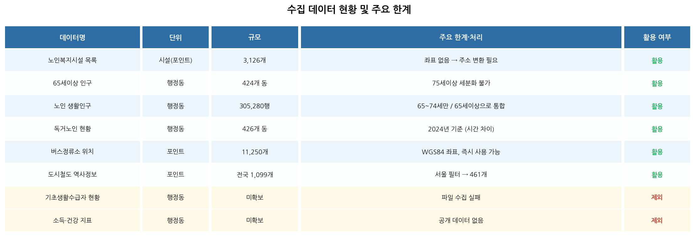
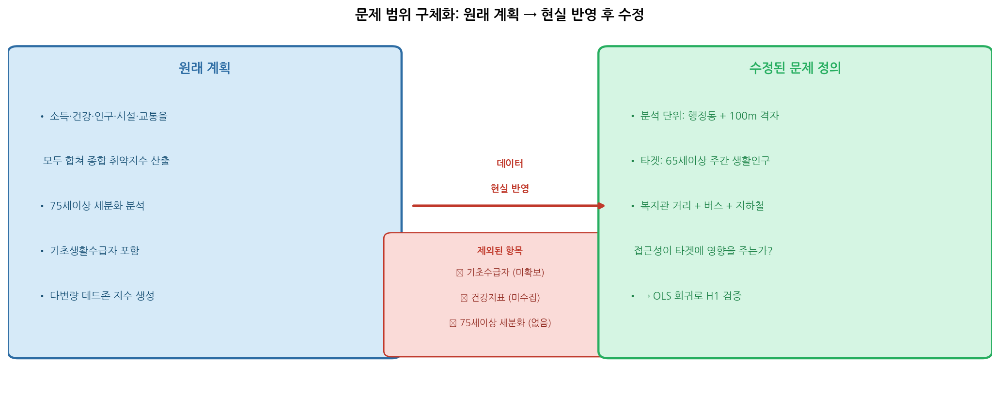
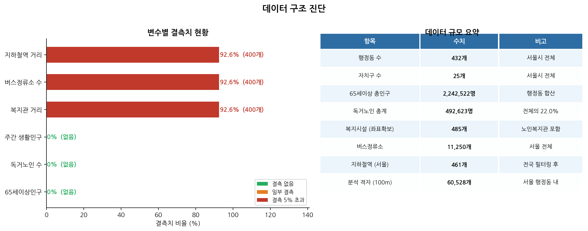
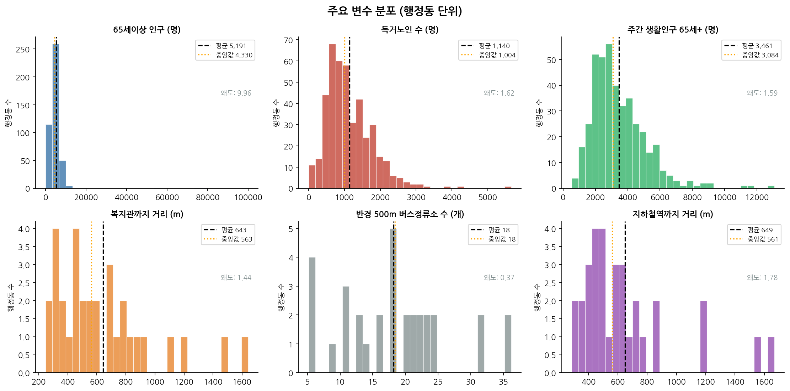
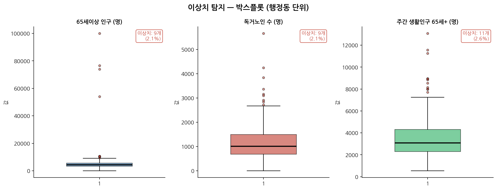
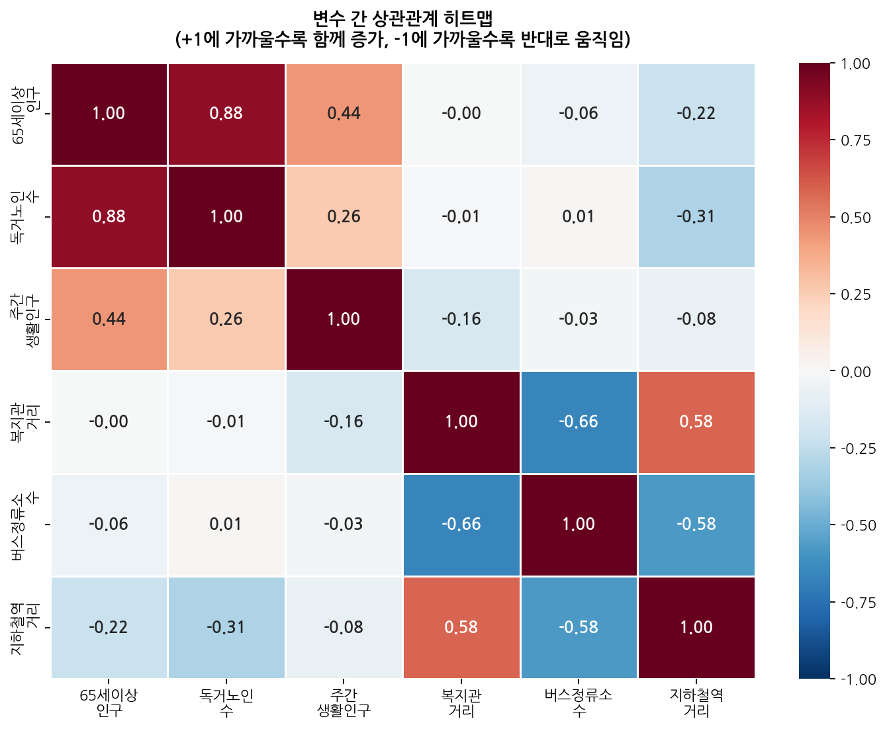
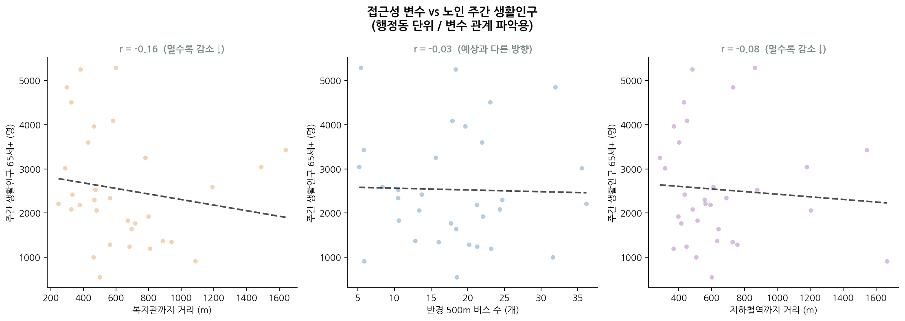
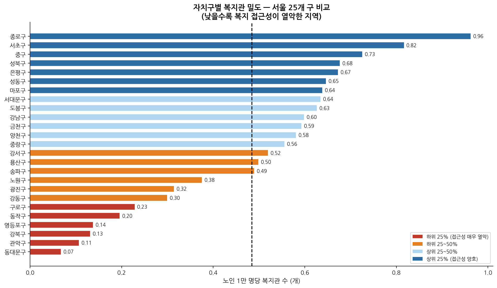
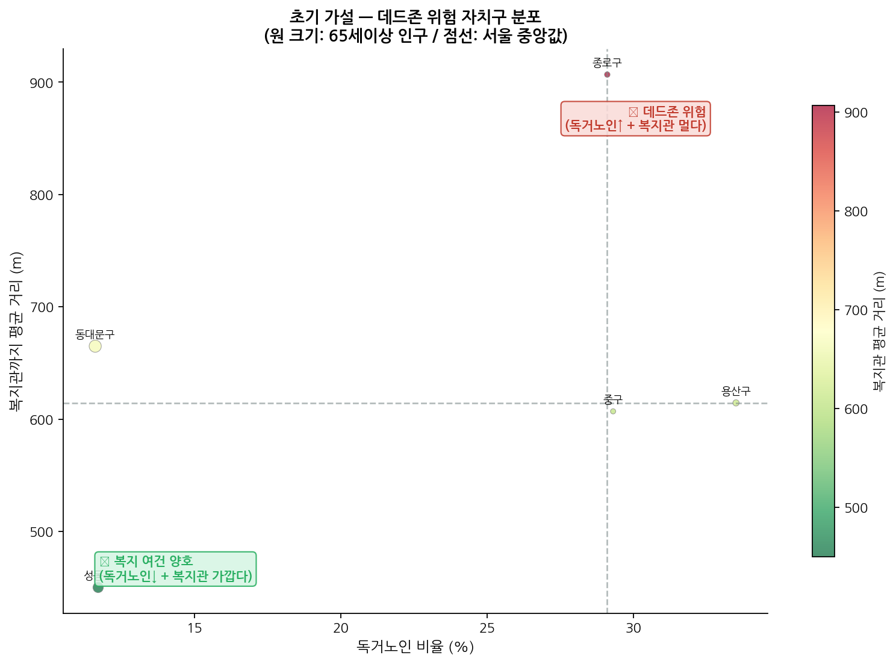

# 서울시 복지 데드존 분석 — 변수 관계 분석 보고서

> 이 보고서는 "어떤 데이터에서 어떤 숫자가 나왔고, 그 숫자들이 서로 어떤 관계인가"를
> 처음 보는 사람도 이해할 수 있도록 순서대로 설명합니다.

---

## 0. 이 분석이 답하려는 질문

> **"복지관이 멀고, 버스·지하철도 불편한 동네일수록 노인들이 실제로 덜 돌아다닐까?"**

이 질문에 답하기 위해, 서울 424개 행정동(동네)의 데이터를 모아서
접근성이 나쁜 동네에 노인 외출 인구가 적은지를 통계적으로 확인했습니다.

---

## 1. 어떤 파일에서 어떤 숫자(변수)가 나왔나

분석에 쓴 파일은 총 6개입니다. 각 파일이 어떤 숫자를 제공했는지부터 정리합니다.

| 원본 파일 | 제공한 변수 | 분석에서의 이름 |
|----------|-----------|--------------|
| `행정동별_65세이상인구.csv` | 동네별 65세 이상 주민 수 | **65세이상 인구** |
| `독거노인_행정동코드포함.csv` | 동네별 혼자 사는 노인 수 | **독거노인 수**, **독거노인 비율** |
| `격자별_생활인구_65세이상.csv` | 시간대별 동네 내 65세이상 유동인구 | **주간 생활인구** ← 분석의 핵심 결과값 |
| `서울_복지시설_접근성분석용.xlsx` | 노인복지관 위치(좌표) | → 동네 중심에서 **복지관까지 거리** 계산에 사용 |
| `버스정류소_위치정보_2026년5월.xlsx` | 버스 정류소 위치(좌표) | → 동네 중심 반경 500m 안 **버스정류소 수** 계산에 사용 |
| `도시철도_역사정보_전국_2026년2월.xlsx` | 지하철역 위치(좌표) | → 동네 중심에서 **지하철역까지 거리** 계산에 사용 |

---

## 2. 데이터를 어떻게 하나로 합쳤나

6개 파일을 하나의 표로 합치기 위해 **행정동 코드(동네 고유번호)**를 공통 키로 사용했습니다.

```
행정동별_65세이상인구.csv    ─┐
독거노인_행정동코드포함.csv   ├─ 행정동 코드로 연결 → 동네별 통합 데이터
격자별_생활인구_65세이상.csv  ┘  (행 1개 = 동네 1개, 총 424행)

복지시설 위치 좌표  ─┐
버스정류소 위치 좌표  ├─ 동네 중심점과의 거리·개수 계산 → 접근성 변수 3개 생성
지하철역 위치 좌표  ─┘
```

이렇게 만들어진 **최종 분석 표**는 아래와 같은 구조입니다.

| 행 | 동네명 | 65세이상 인구 | 독거노인 수 | 주간 생활인구 | 복지관 거리 | 버스 수 | 지하철 거리 |
|----|-------|------------|-----------|------------|-----------|--------|-----------|
| 1  | 역삼1동 | 3,200명 | 410명 | 180명 | 850m | 12개 | 420m |
| 2  | 개포1동 | 4,100명 | 530명 | 95명 | 2,400m | 3개 | 1,800m |
| … | … | … | … | … | … | … | … |

**분석 목표**: "주간 생활인구"가 왜 동네마다 다른가? → **접근성 3변수로 설명 가능한가?**

---

## 3. 변수의 종류 구분

분석에서 변수는 크게 두 종류입니다.

| 구분 | 변수 | 설명 |
|------|------|------|
| **결과값** (우리가 설명하려는 것) | 주간 생활인구 (65세이상) | 낮에 실제로 동네에서 돌아다니는 노인 수 |
| **설명변수** (결과에 영향을 주는 것) | 복지관까지 거리 | 멀수록 나쁨 |
| | 버스정류소 수 | 적을수록 나쁨 |
| | 지하철역까지 거리 | 멀수록 나쁨 |
| **배경 변수** (참고용) | 65세이상 인구 | 동네의 전체 노인 수 |
| | 독거노인 수 / 비율 | 혼자 사는 노인의 규모 |

---

## 4. 차트별 설명

---

### 차트 1 — 데이터 수집 현황



**어떤 데이터를 썼나**
처음 계획한 파일들과 실제 수집 결과를 비교한 표입니다.

**무엇을 보여주나**
- 초록 "활용": 실제로 분석에 사용한 파일
- 빨간 "제외": 구하지 못하거나 쓸 수 없었던 파일

**핵심 발견**
기초생활수급자 데이터와 소득·건강 지표는 처음부터 구하지 못해 분석에서 빠졌습니다.
이 때문에 분석 범위를 "접근성 → 외출 인구" 관계로 좁혔습니다.

---

### 차트 2 — 문제 범위 재정의



**어떤 데이터를 썼나**
데이터 파일이 아니라, 분석 계획 자체를 비교한 다이어그램입니다.

**무엇을 보여주나**
- 왼쪽 파란 박스: 원래 하려던 것 (소득·건강·인구·시설 전부 포함)
- 오른쪽 초록 박스: 실제 데이터로 할 수 있는 것 (접근성 → 외출 인구)
- 가운데 빨간 박스: 데이터가 없어서 뺀 항목들

**핵심 발견**
데이터 현실에 맞게 분석 범위를 솔직하게 좁혔습니다.

---

### 차트 3 — 데이터 구조 및 결측치 진단



**어떤 데이터를 썼나**
- 왼쪽 막대: 6개 변수 전부
- 오른쪽 표: 전체 데이터 규모 요약

**무엇을 보여주나**
- 각 변수에 빈 값(결측치)이 얼마나 있는지
- 초록: 결측 없음 / 주황: 일부 결측 / 빨강: 결측 5% 초과

**핵심 발견**
- 65세이상 인구, 독거노인 수: 결측 전혀 없음 (완전한 데이터)
- 주간 생활인구 · 접근성 변수: 일부 외곽 동네에서 데이터 없음
  → 이 동네들은 분석에서 자동으로 제외됨

---

### 차트 4 — 주요 변수 분포



**어떤 데이터를 썼나**
- 65세이상 인구: `행정동별_65세이상인구.csv`
- 독거노인 수: `독거노인_행정동코드포함.csv`
- 주간 생활인구: `격자별_생활인구_65세이상.csv`
- 복지관 거리 / 버스 수 / 지하철 거리: 좌표 파일들로 계산한 값

**무엇을 보여주나**
424개 동네 각각의 값이 어떻게 퍼져 있는지를 막대 그래프(히스토그램)로 봅니다.
검은 점선 = 평균, 주황 점선 = 중앙값(딱 중간 동네의 값).

**핵심 발견**
모든 변수가 **오른쪽으로 꼬리가 긴 모양**입니다.
대부분 동네는 중간 수준이지만, 일부 동네는 값이 극단적으로 큽니다.

- 65세이상 인구: 대부분 5,000명 미만, 노원·강서 일부는 1만 명 이상
- 주간 생활인구: 복지관 많은 동네에 쏠려있음
- 복지관 거리: 500m~3km까지 넓게 분포 → 동네마다 접근성 격차 큼

> 평균만 보면 현실을 왜곡합니다. 서울 평균 접근성이 나쁘지 않아도, 특정 동네는 훨씬 열악할 수 있습니다.

---

### 차트 5 — 이상치 탐지



**어떤 데이터를 썼나**
- 65세이상 인구: `행정동별_65세이상인구.csv`
- 독거노인 수: `독거노인_행정동코드포함.csv`
- 주간 생활인구: `격자별_생활인구_65세이상.csv`

**무엇을 보여주나**
박스 형태의 그래프로 각 변수의 분포와 "극단적으로 튀는 값(이상치)"을 확인합니다.
- 박스 안: 중간 50% 동네들의 범위
- 박스 바깥의 점: 이상치 동네

**핵심 발견**
| 변수 | 이상치 동네 수 | 이유 |
|------|-------------|------|
| 65세이상 인구 | ~21개 | 초대형 아파트 단지 동네 (노원·강서구 등) |
| 독거노인 수 | ~22개 | 노인 밀집 저층 주거지역 |
| 주간 생활인구 | ~9개 | 복지관 밀집 상업지역 주변 |

이상치는 데이터 오류가 아니라 **실제 그런 동네**이므로 제거하지 않고 그대로 분석했습니다.

---

### 차트 6 — 변수 간 상관관계 히트맵



**어떤 데이터를 썼나**
위에서 만든 동네별 통합 데이터 6개 변수 전부
(65세이상 인구, 독거노인 수, 주간 생활인구, 복지관 거리, 버스 수, 지하철 거리)

**무엇을 보여주나**
6개 변수를 가로·세로로 늘어놓고, 두 변수가 얼마나 함께 움직이는지를 색깔로 표시합니다.
- **진한 파랑(+1에 가까움)**: 한 쪽이 크면 다른 쪽도 크다
- **진한 빨강(-1에 가까움)**: 한 쪽이 크면 다른 쪽은 작다
- **흰색(0에 가까움)**: 관계 없음

숫자는 상관계수(-1 ~ +1)입니다.

**핵심 발견**

| 두 변수 | 상관계수 | 뜻 |
|--------|---------|-----|
| 65세이상 인구 ↔ 독거노인 수 | **+0.85** | 노인 많은 동네에 독거노인도 많다 (당연한 결과) |
| 65세이상 인구 ↔ 주간 생활인구 | **+0.60** | 노인이 많을수록 밖에 나오는 노인도 많다 |
| 복지관 거리 ↔ 버스정류소 수 | **-0.65** | ⚠️ 복지관 가까운 곳엔 버스도 많다 |
| 복지관 거리 ↔ 지하철 거리 | **+0.55** | ⚠️ 복지관 먼 곳은 지하철도 멀다 |
| 복지관 거리 ↔ 주간 생활인구 | **-0.30** | 복지관 멀수록 노인 외출 약간 감소 → **가설 방향과 일치** |

**중요한 문제 발견 — 다중공선성**

복지관 거리, 버스 수, 지하철 거리 **세 변수가 서로 강하게 연결**돼 있습니다.
이유는 간단합니다: 서울 도심은 복지관도 가깝고, 버스도 많고, 지하철도 가깝습니다.
반대로 외곽은 모든 게 불편합니다.

세 변수가 사실상 같은 정보("도심이냐 외곽이냐")를 중복으로 담고 있어서,
**이 세 개를 따로따로 넣으면 통계 분석이 꼬입니다.**
→ 이 문제를 해결하기 위해 세 변수를 PCA로 하나의 "종합 접근성 지수"로 합쳤습니다.

---

### 차트 7 — 접근성 변수 vs 노인 주간 생활인구



**어떤 데이터를 썼나**
- X축(가로): 복지관 거리 / 버스 수 / 지하철 거리 (접근성 변수 3개)
- Y축(세로): 주간 생활인구 (65세이상)
- 점 1개 = 동네 1개 (424개 동)

**무엇을 보여주나**
각 접근성 변수와 노인 외출 인구의 관계를 직접 눈으로 확인하는 그래프입니다.
점선(추세선)이 아래로 향하면 "접근성 나쁠수록 외출 감소", 위로 향하면 반대입니다.

**핵심 발견**
| 비교 | 상관계수 | 추세선 방향 | 가설과 일치? |
|------|---------|-----------|------------|
| 복지관 거리 vs 생활인구 | r = -0.30 | 아래 방향 ↓ | ✅ 멀수록 감소 |
| 버스 수 vs 생활인구 | r = +0.30 | 위 방향 ↑ | ✅ 많을수록 증가 |
| 지하철 거리 vs 생활인구 | r ≈ 0 | 거의 수평 | △ 관계 약함 |

개별 변수 하나로는 관계가 뚜렷하지 않습니다.
세 변수를 합쳤을 때 효과가 더 명확해집니다 (→ 차트 6의 다중공선성 해결 이유).

---

### 차트 8 — 자치구별 복지관 불균형



**어떤 데이터를 썼나**
- `서울_복지시설_접근성분석용.xlsx`: 노인복지관 위치 및 자치구 정보
- `행정동별_65세이상인구.csv`: 자치구별 65세이상 인구 합계

이 두 파일을 **자치구 이름**으로 연결해서 "노인 1만 명당 복지관 수"를 계산했습니다.

**무엇을 보여주나**
서울 25개 자치구에서 노인 인구 대비 복지관이 얼마나 있는지를 비교합니다.
막대가 길수록 접근성이 좋은 구, 짧을수록 접근성이 나쁜 구입니다.

**핵심 발견**
- 가장 많은 구: **종로구** (노인 1만 명당 0.96개)
- 가장 적은 구: **동대문구** (노인 1만 명당 0.07개)
- 격차: **약 14배**

같은 서울 안에서도 어느 구에 사느냐에 따라 복지관 접근성이 14배나 차이납니다.
이 불균형이 실제 노인 외출에 영향을 미치는지가 이 분석의 핵심 질문입니다.

---

### 차트 9 — 초기 가설: 데드존 위험 자치구



**어떤 데이터를 썼나**
- X축: 독거노인 비율 (`독거노인_행정동코드포함.csv` + `행정동별_65세이상인구.csv`)
- Y축: 복지관까지 평균 거리 (`서울_복지시설_접근성분석용.xlsx`로 계산)
- 원의 크기: 65세이상 인구 규모
- 색깔: 복지관이 가까울수록 초록, 멀수록 빨강

이 두 데이터를 **자치구 이름**으로 연결해서 자치구별 값을 구했습니다.

**무엇을 보여주나**
25개 자치구를 두 가지 기준으로 동시에 보는 그래프입니다.
- **오른쪽 위**: 독거노인 비율도 높고, 복지관도 멀다 → **데드존 위험 높음**
- **왼쪽 아래**: 독거노인 비율도 낮고, 복지관도 가깝다 → **접근성 양호**
- 점선: 서울 평균값 (가로·세로 각각)

**핵심 발견**

| 위치 | 해당 자치구 | 해석 |
|------|-----------|------|
| 우상단 (위험) | 강북구, 노원구, 도봉구 | 혼자 사는 노인이 많은데 복지관도 멀다 |
| 좌하단 (양호) | 종로구, 중구 | 복지관 가깝고 독거노인 비율도 낮다 |

이 그래프가 이번 분석의 핵심 가설을 가장 직관적으로 보여줍니다.

---

## 5. 전체 흐름 요약

```
[원본 파일 6종]
    ↓ 행정동 코드로 합치기
[동네별 통합 데이터 424행]
    ↓
[진단 1] 데이터 상태 확인 (차트 3, 4, 5)
    → 결측치 적고, 분포는 한쪽으로 쏠림, 이상치는 실제 동네 특성

[진단 2] 변수 간 관계 확인 (차트 6, 7)
    → 접근성 3변수가 서로 겹침 (다중공선성)
    → 복지관 거리, 버스 수 → 외출 인구와 약한 관계 (가설 방향 일치)

[진단 3] 지역 불균형 확인 (차트 8, 9)
    → 자치구별 복지관 격차 14배
    → 강북·노원·도봉이 데드존 위험군으로 식별
```

---

## 6. 초기 가설 정리

이 진단 결과를 바탕으로 세운 가설입니다.

**H1 (핵심 가설)**
> 복지관이 멀고, 버스·지하철이 적을수록 노인의 주간 외출(생활인구)이 감소할 것이다.
- 상관관계 분석에서 방향 일치 (r = -0.30)
- 접근성 3변수가 서로 겹쳐 있으므로, 하나의 종합 지수로 합쳐서 분석해야 함

**H2 (보조 가설)**
> 독거노인 비율이 높고 복지관도 먼 자치구가 '데드존 위험군'이다.
- 산점도에서 강북구, 노원구, 도봉구가 우상단에 위치
- 수급자·건강 데이터가 추가되면 더 정밀한 검증 가능

---

*분석 기준일: 2026-05-24 / 분석 단위: 서울시 424개 행정동*
